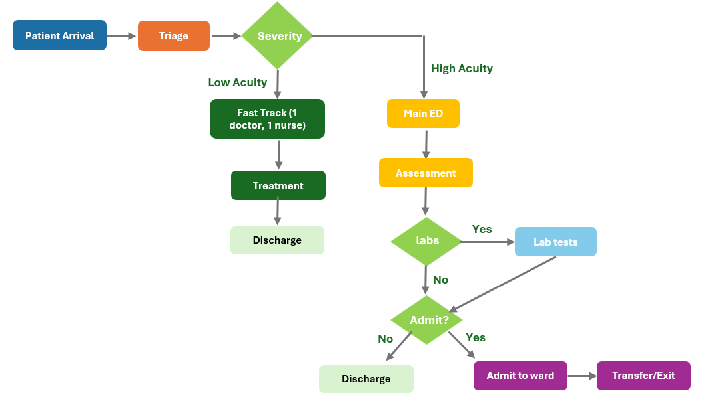

### **Task 2: System Components & Process Flow**

| System | Emergency Department |
|--------|---------------------|
| **Entities** | Patients (low acuity, high acuity) |
| **Resources** | Fast Track doctors/nurses, Main ED doctors/nurses, beds, lab technicians |
| **Attributes** | Acuity level, service time, lab requirements |
| **Activity** | Triage, treatment, lab testing, discharge/admission |
| **Events** | Arrival, triage completion, treatment start/end, lab results, discharge, admission |
| **State variables** | Number of patients waiting in each queue, resource utilization rates |

#### **Input Data Required**
- **Arrival Patterns**: Hourly/daily patient rates by acuity (Poisson process)
- **Service Times**: Triage (5-15 min), Fast Track (20-60 min), Main ED (60-240 min)
- **Clinical Probabilities**: Lab requirements (30-70%), admission rates (10-50%)
- **Resource Capacity**: Staffing levels and bed counts by area
- **Operational Parameters**: Boarding times, discharge procedures

#### **Simulation Outputs**
- **Performance Metrics**: Wait times, length of stay, throughput rates
- **Resource Analytics**: Utilization rates, queue lengths, bottleneck identification  
- **Service Quality**: 4-hour compliance, 90th percentile performance
- **Strategic KPIs**: Constraint risk assessment, ROI impact analysis

#### **Model Assumptions**
- **Patient Flow**: 70% low acuity → Fast Track, 30% high acuity → Main ED
- **Arrival Process**: Poisson arrivals with exponential inter-arrival times
- **Service Times**: Lognormal distributions (realistic right-skew)
- **No Balking**: Patients don't leave due to wait times
- **Resource Availability**: 24/7 operation with consistent staffing
- **Boarding Process**: Admitted patients hold beds until transfer (2-hour average)